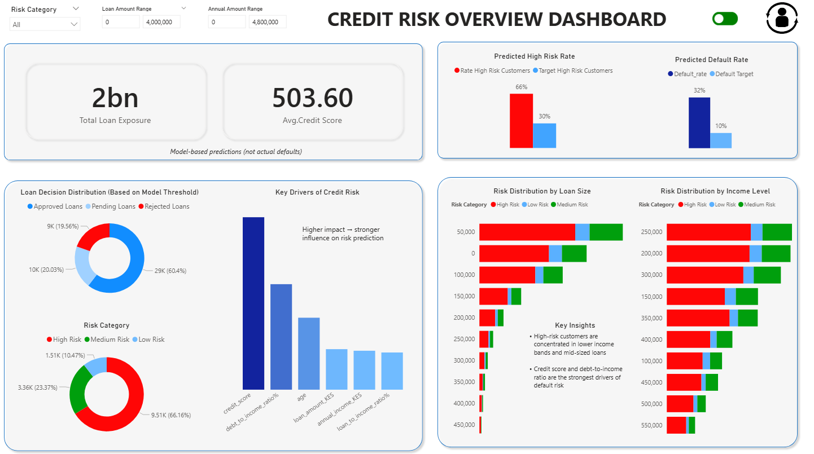

# Customer Credit Risk Assessment Model

## Project Overview
This project focuses on building a data-driven credit risk assessment system to identify high-risk borrowers and support more accurate lending decisions. The solution addresses limitations in traditional credit scoring by incorporating behavioral, financial, and engineered risk indicators.

---

## Business Problem
The existing lending system was underperforming due to structural and data limitations:

- Default rate at 18.3% vs. 9.5% industry benchmark, resulting in significant financial losses (~KES 439M annually)
- 12% of applicants lacked credit scores, yet ~40% of them were creditworthy
- A single approval threshold was applied across all loan sizes, reducing decision accuracy
- ~3% duplicate applications were used to bypass rejection rules
- 35% of applicants had informal income, making traditional assessment unreliable
- Current model used only 8 features, ignoring rich transaction-level data (80,000+ records)

Additionally, the available default variable showed weak predictive signal, limiting the effectiveness of standard supervised learning models.

---

## Objectives
- Reconstruct a reliable target variable for credit risk classification
- Improve detection of high-risk customers (increase recall)
- Build and compare machine learning models for risk prediction
- Balance precision and recall to align with business risk tolerance

---

## Dataset Description
The dataset includes customer demographic and financial attributes such as age, income, loan amounts, and credit scores. Additional behavioral features were engineered, including financial ratios and aggregated customer-level patterns derived from transactional data.

---

## Methodology

### Data Preparation
- Cleaned and validated dataset
- Engineered financial ratios (loan-to-income, debt-to-income)
- Aggregated customer-level behavioral insights

### Target Engineering
- Identified issues with the original default variable (low signal / randomness)
- Created a composite risk score (`all_scores_included`) based on financial indicators
- Introduced stochastic scoring within credit score bands to reduce deterministic relationships
- Derived binary classification label using threshold-based logic

### Handling Class Imbalance
- Applied SMOTE to improve detection of minority (high-risk) class

### Modeling
Trained and compared:
- Logistic Regression
- Random Forest
- XGBoost

### Evaluation Metrics
- Precision
- Recall
- F1 Score
- Accuracy

---

## Model Performance

| Model | Recall | Precision | F1 Score | Accuracy |
|------|--------|----------|----------|----------|
| Logistic Regression | 0.740 | 0.681 | 0.709 | 0.697 |
| Random Forest | 0.773 | 0.739 | 0.756 | 0.750 |
| XGBoost | 0.771 | 0.750 | 0.760 | 0.757 |

---

## Insights
- Target quality significantly impacts model performance
- Feature-engineered proxy labels can improve learning when real outcomes are unreliable
- Controlled randomness reduces leakage and improves generalization
- Tree-based models outperform linear models in capturing nonlinear financial risk patterns
- Precision–recall trade-offs are critical in credit risk, with recall prioritized to minimize financial losses

---

## Challenges
- Detecting and mitigating target leakage
- Engineering a realistic proxy target without overfitting
- Balancing model performance with interpretability
- Handling incomplete and informal financial data

---

## Conclusion
This project demonstrates the importance of data quality, feature engineering, and problem framing in credit risk modeling. By reconstructing the target variable and improving feature representation, the models achieved realistic and reliable performance. XGBoost emerged as the best-performing model, offering a strong balance between identifying high-risk customers and minimizing false positives.

---

## Project Structure
```
├── data/
├── notebooks/
├── models/
├── dashboard/
└── README.md
```
---

## Future Work
- Incorporate real-world default data
- Implement cost-sensitive modeling
- Introduce dynamic approval thresholds based on loan size
- Deploy model as an API for real-time scoring

---
## Dashboard Preview




---


